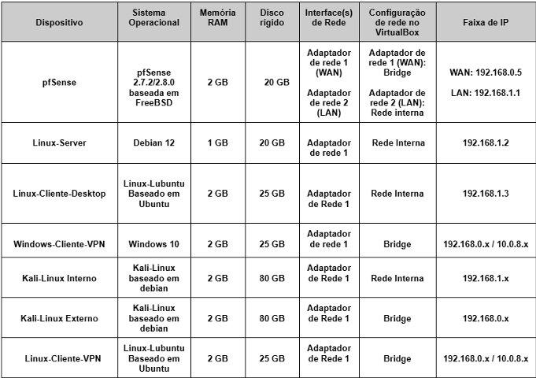

# Segurança de Redes com pfSense

### Implementação de Firewall, VPN e Autenticação Multifator com FreeRADIUS e Google Authenticator

## Sobre o projeto

Este repositório reúne a documentação, imagens e demais materiais utilizados no desenvolvimento do meu Trabalho de Conclusão de Curso (TCC) do curso de Tecnologia em Redes de Computadores.

## Contextualização

As pequenas empresas frequentemente enfrentam dificuldades para implantar soluções robustas de segurança da informação devido às limitações orçamentárias e à escassez de recursos técnicos especializados. Como consequência, muitas operam com mecanismos de proteção insuficientes, tornando-se mais vulneráveis a ameaças como acessos não autorizados, vazamento de dados, malware e outros ataques cibernéticos.

Além disso, o crescimento do trabalho remoto e híbrido durante e após a pandemia de COVID-19 ampliou a necessidade de acesso seguro aos recursos corporativos.  Mesmo após o período mais crítico da pandemia, esse modelo de trabalho permaneceu sendo adotado por diversas organizações, aumentando a importância de soluções que permitam conexões remotas protegidas e um controle de acesso mais seguro à infraestrutura de rede.

Nesse contexto, este projeto apresenta a implementação, em um **ambiente de laboratório virtualizado**, de uma solução de segurança de baixo custo para pequenas empresas utilizando o **pfSense** como firewall principal. A solução contempla a configuração do **OpenVPN** para acesso remoto seguro com **autenticação multifator (MFA)**, por meio da integração entre **FreeRADIUS** e **Google Authenticator**. A proposta busca demonstrar como ferramentas de código aberto podem fortalecer a segurança da infraestrutura de rede sem exigir investimentos elevados em licenciamento de software, oferecendo uma alternativa acessível e eficiente para organizações com recursos financeiros limitados.

---

## Objetivos

- Montar um ambiente virtualizado simulando uma infraestrutura básica de uma pequena empresa.
- Configurar regras para controle de tráfego no pfSense.
- Implantar acesso remoto seguro por meio do OpenVPN e autenticação multifator.
- Validar a solução por meio de testes práticos.

---

## Ambiente de testes

### Hardware

- Notebook Intel Core i3
- 8 GB de memória RAM
- Sistema operacional Windows 11

## Tecnologias, sistemas e softwares utilizados

- pfSense CE
- OpenVPN
- FreeRADIUS
- Google Authenticator
- VirtualBox
- Kali Linux
- Windows 10
- Linux Lubuntu
- Linux Debian
- Nmap
- Netcat

## Implementação

Para iniciar a implementação, foi realizada a criação do ambiente virtualizado no VirtualBox. A máquina virtual do **pfSense** foi configurada com duas interfaces de rede: a primeira interface, destinada à **WAN**, foi configurada em modo **Bridge** para permitir o acesso à internet através da rede existente; a segunda interface, destinada à **LAN**, foi configurada utilizando o modo **Rede Interna**, responsável pela comunicação entre os dispositivos do ambiente de laboratório.

Na rede interna foram criadas máquinas virtuais para representar diferentes cenários de uma infraestrutura corporativa. A VM **Linux-Cliente-Desktop** foi utilizada para simular uma estação de trabalho pertencente à rede local, representando um usuário administrador. O **Kali Linux** foi inserido no ambiente interno para realização de testes de segurança e validação das regras de firewall implementadas no pfSense.

Também foi configurado um servidor **Debian** para simular um servidor corporativo localizado dentro da rede LAN, disponibilizando serviços como **Apache** e **Samba**. Esse servidor foi utilizado para validar o acesso remoto aos serviços internos através da conexão VPN.

Por fim, foram criadas máquinas virtuais com sistemas **Windows** e **Linux** configuradas em modo **Bridge**, simulando dispositivos externos que realizam conexões remotas à rede interna por meio da VPN.

A relação das máquinas virtuais criadas e suas respectivas configurações básicas é apresentada na tabela abaixo.

## Topologia da infraestrutura virtual implementada

A infraestrutura foi organizada em três segmentos distintos: **rede interna**, **firewall/roteador** e **rede externa**, conforme apresentado na Figura acima.

A **rede interna (LAN - 192.168.1.0/24)** representa o ambiente corporativo protegido, sendo composta por estações de trabalho, servidores e uma máquina utilizada para simular um agente malicioso.

O **firewall pfSense** atua como ponto central de interconexão entre as redes, sendo responsável pela aplicação das políticas de filtragem, tradução de endereços (NAT), roteamento e gerenciamento dos serviços de segurança.

Por sua vez, a **rede externa (WAN - 192.168.0.0/24 e VPN - 10.0.8.0/24)** representa a conexão com a internet e os usuários remotos que necessitam acessar recursos internos por meio de conexões VPN seguras. Também foi utilizada uma estação externa para simular ataques originados fora da rede corporativa.

Essa segmentação permite reproduzir cenários reais de acesso remoto, administração de serviços e aplicação de políticas de segurança, possibilitando a realização de testes de validação da arquitetura proposta.

## Resultados

A implementação demonstrou que é possível construir uma infraestrutura de segurança para pequenas empresas utilizando soluções de código aberto, reduzindo custos de implantação sem comprometer os requisitos básicos de proteção da rede.

---

## Autor

**Leandro Lima**

Tecnólogo em Redes de Computadores

Instituto Federal do Rio Grande do Norte (IFRN)