# Segurança de Redes com pfSense

### Implementação de Firewall, VPN e Autenticação Multifator com FreeRADIUS e Google Authenticator

## Sobre o projeto

Este repositório reúne a documentação, imagens e demais materiais utilizados no desenvolvimento do meu Trabalho de Conclusão de Curso (TCC) do curso de Tecnologia em Redes de Computadores.

## Contextualização

As pequenas empresas frequentemente enfrentam dificuldades para implantar soluções robustas de segurança da informação devido às limitações orçamentárias e à escassez de recursos técnicos especializados. Como consequência, muitas operam com mecanismos de proteção insuficientes, tornando-se mais vulneráveis a ameaças como acessos não autorizados, vazamento de dados, malware e outros ataques cibernéticos.

Além disso, o crescimento do trabalho remoto e híbrido durante e após a pandemia de COVID-19 ampliou a necessidade de acesso seguro aos recursos corporativos.  Mesmo após o período mais crítico da pandemia, esse modelo de trabalho permaneceu sendo adotado por diversas organizações, aumentando a importância de soluções que permitam conexões remotas protegidas e um controle de acesso mais seguro à infraestrutura de rede.

Nesse contexto, este projeto apresenta a implementação, em um **ambiente de laboratório virtualizado**, de uma solução de segurança de baixo custo para pequenas empresas utilizando o **pfSense** como firewall principal. A solução contempla a configuração do **OpenVPN** para acesso remoto seguro com **autenticação multifator (MFA)**, por meio da integração entre **FreeRADIUS** e **Google Authenticator**. A proposta busca demonstrar como ferramentas de código aberto podem fortalecer a segurança da infraestrutura de rede sem exigir investimentos elevados em licenciamento de software, oferecendo uma alternativa acessível e eficiente para organizações com recursos financeiros limitados.

---

## Objetivos

- Montar um ambiente virtualizado simulando uma infraestrutura básica de uma pequena empresa.
- Configurar regras para controle de tráfego no pfSense.
- Implantar acesso remoto seguro por meio do OpenVPN e autenticação multifator.
- Validar a solução por meio de testes práticos.

---

## Ambiente de testes

### Hardware

- Notebook Intel Core i3
- 8 GB de memória RAM
- Sistema operacional Windows 11

## Tecnologias, sistemas e softwares utilizados

- pfSense CE
- OpenVPN
- FreeRADIUS
- Google Authenticator
- VirtualBox
- Kali Linux
- Windows 10
- Linux Lubuntu
- Linux Debian
- Nmap
- Netcat

## Implementações

Para iniciar a implementação, foi realizada a criação do ambiente virtualizado no VirtualBox. A máquina virtual do **pfSense** foi configurada com duas interfaces de rede: a primeira interface, destinada à **WAN**, foi configurada em modo **Bridge** para permitir o acesso à internet através da rede existente; a segunda interface, destinada à **LAN**, foi configurada utilizando o modo **Rede Interna**, responsável pela comunicação entre os dispositivos do ambiente de laboratório.

Na rede interna foram criadas máquinas virtuais para representar diferentes cenários de uma infraestrutura corporativa. A VM **Linux-Cliente-Desktop** foi utilizada para simular uma estação de trabalho pertencente à rede local, representando um usuário administrador. O **Kali Linux** foi inserido no ambiente interno para realização de testes de segurança e validação das regras de firewall implementadas no pfSense.

Também foi configurado um servidor **Debian** para simular um servidor corporativo localizado dentro da rede LAN, disponibilizando serviços como **Apache** e **Samba**. Esse servidor foi utilizado para validar o acesso remoto aos serviços internos através da conexão VPN.

Por fim, foram criadas máquinas virtuais com sistemas **Windows** e **Linux** configuradas em modo **Bridge**, simulando dispositivos externos que realizam conexões remotas à rede interna por meio da VPN.

A relação das máquinas virtuais criadas e suas respectivas configurações básicas é apresentada na tabela abaixo.

**Figura 01 – Tabela das máquinas virtuais do laboratório.**

---

### Topologia da infraestrutura virtual implementada

**Figura 02 – Topologia da infraestrutura virtual implementada.**

A infraestrutura foi organizada em três segmentos distintos: **rede interna**, **firewall/roteador** e **rede externa**, conforme apresentado na Figura acima.

A **rede interna (LAN - 192.168.1.0/24)** representa o ambiente corporativo protegido, sendo composta por estações de trabalho, servidores e uma máquina utilizada para simular um agente malicioso.

O **firewall pfSense** atua como ponto central de interconexão entre as redes, sendo responsável pela aplicação das políticas de filtragem, tradução de endereços (NAT), roteamento e gerenciamento dos serviços de segurança.

Por sua vez, a **rede externa (WAN - 192.168.0.0/24 e VPN - 10.0.8.0/24)** representa a conexão com a internet e os usuários remotos que necessitam acessar recursos internos por meio de conexões VPN seguras. Também foi utilizada uma estação externa para simular ataques originados fora da rede corporativa.

Essa segmentação permite reproduzir cenários reais de acesso remoto, administração de serviços e aplicação de políticas de segurança, possibilitando a realização de testes de validação da arquitetura proposta.

---

### Configurações Iniciais do pfSense

Após a instalação do **pfSense**, foram realizadas as configurações iniciais da infraestrutura de rede.

As interfaces **WAN** e **LAN** foram configuradas com endereços IP estáticos, conforme o esquema de endereçamento definido para o ambiente de laboratório:

- **WAN:** `192.168.0.5/24`
- **LAN:** `192.168.1.1/24`

Além disso, a interface de gerenciamento **WebConfigurator** foi configurada para aceitar conexões exclusivamente pela interface **LAN**, ficando disponível no endereço `https://192.168.1.1`. Essa configuração restringe o acesso administrativo à rede interna, reduzindo a exposição da interface de gerenciamento.

As configurações iniciais das interfaces **WAN** e **LAN** são apresentadas na figura abaixo.

**Figura 03 – Configuração iniciais do pfSense nas interfaces WAN e LAN.**

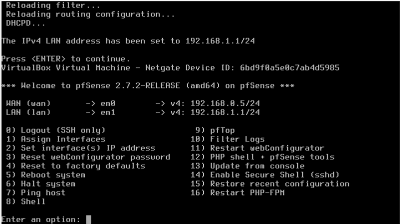

Após a configuração das interfaces de rede, o gerenciamento do firewall passou a ser realizado por meio da interface web (**WebConfigurator**), acessível através da rede LAN.

**Figura 04 – Tela inicial do WebConfigurator do pfSense.**

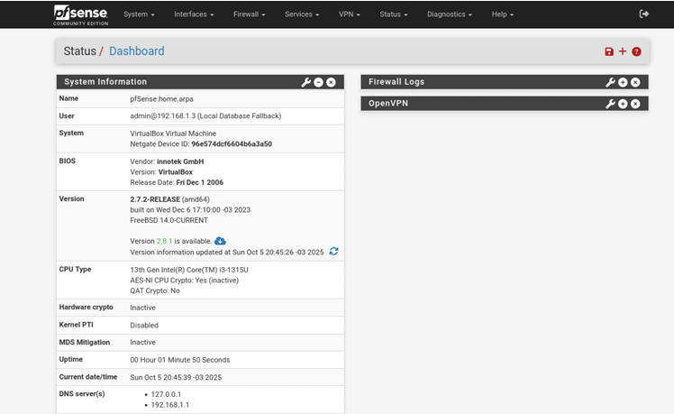

---

### Plano de endereçamento IP

Inicialmente, foi definido o esquema de endereçamento da rede local. Para isso, foram configuradas no servidor **DHCP** reservas de endereços IP para as máquinas **Linux-Server-Empresa** e **Linux-Cliente-Desktop**, além de alguns endereços adicionais destinados à utilização como IPs estáticos.

O intervalo de endereços estáticos da rede foi definido entre **192.168.1.1** (gateway padrão) e **192.168.1.5/24**. O servidor **DHCP** foi configurado para distribuir endereços IP dinamicamente no intervalo de **192.168.1.6** a **192.168.1.254**, utilizando máscara de sub-rede **/24**.

Essa estratégia simplifica o gerenciamento da infraestrutura, facilita a criação de regras de firewall e permite a identificação consistente dos dispositivos presentes na rede. As configurações realizadas são ilustradas nas figuras abaixo.

**Figura 05 – Reservas de endereços IP estáticos.**

**Figura 06 – Configuração do intervalo de endereços DHCP.**

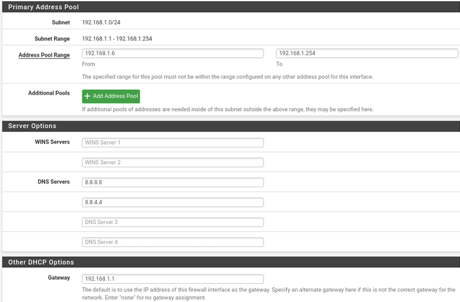

---

### Adequação do Ambiente de Testes

Em razão da utilização de um ambiente de laboratório totalmente virtualizado e baseado exclusivamente em endereços IP privados, foi necessário ajustar algumas configurações padrão do **pfSense** para garantir o correto funcionamento da infraestrutura.

Para isso, foram desabilitadas as opções **Block private networks and loopback addresses** e **Block bogon networks** nas interfaces **WAN** e **LAN**, conforme apresentado na Figura abaixo.

Essas configurações, habilitadas por padrão no pfSense, têm como objetivo impedir o tráfego proveniente de redes privadas e de endereços classificados como *bogon* em ambientes de produção. No entanto, como o ambiente de testes utiliza apenas redes privadas para simular uma infraestrutura corporativa, a desativação temporária dessas opções foi necessária para permitir a comunicação entre as máquinas virtuais.

**Figura 07 – Desabilitando bloqueio de endereços privados.**

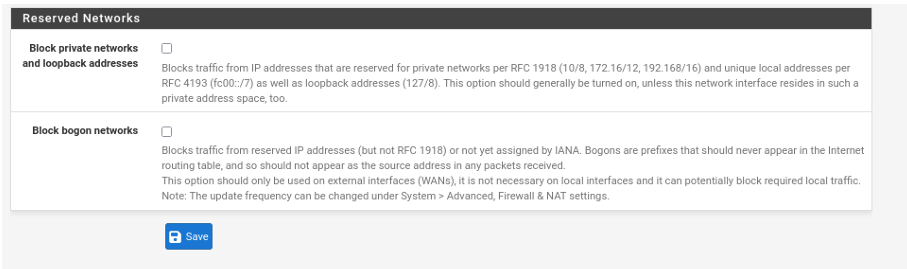

---

### Implementação das regras de firewall

#### Configuração de Aliases

Com o objetivo de aumentar a legibilidade e facilitar a manutenção das políticas de segurança, foram criados **aliases** para agrupar endereços IP, redes e portas utilizados pelas regras de firewall. Essa abordagem é considerada uma boa prática, pois permite alterações centralizadas sem a necessidade de modificar individualmente cada regra associada.

Os seguintes aliases foram configurados:

- **admin_redes**: endereços IP das máquinas dos administradores de rede;
- **admin_vpn**: endereços IP fixos atribuídos aos administradores conectados via VPN;
- **HTTP_HTTPS**: portas **80** (HTTP) e **443** (HTTPS);
- **HTTP_HTTPS_DNS**: portas **80** (HTTP), **443** (HTTPS) e **53** (DNS);
- **Linux_server**: endereço IP do servidor Linux;
- **porta_SMB**: porta **445**, utilizada pelo protocolo SMB para compartilhamento de arquivos.

A configuração dos aliases no **pfSense** é apresentada na figura abaixo.

**Figura 08 – Aliases configurados no pfSense.**

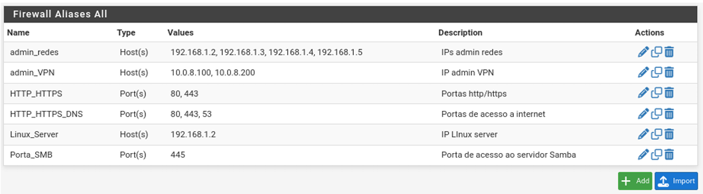

---

#### Política de Segurança Implementada

A política de segurança adotada neste projeto foi estruturada com base em dois princípios fundamentais:

- **Princípio do menor privilégio:** somente o tráfego estritamente necessário é permitido, restringindo o acesso aos serviços essenciais.
- **Política de negação por padrão (*default deny*):** todo tráfego que não esteja explicitamente autorizado pelas regras de firewall é bloqueado automaticamente.

A adoção desses princípios reduz a superfície de ataque da infraestrutura, minimiza a exposição de serviços críticos e contribui para um ambiente de rede mais seguro. Dessa forma, apenas comunicações previamente autorizadas podem atravessar o firewall, reforçando o controle de acesso e a proteção dos recursos da rede.

---

#### Regras de Firewall da Interface WAN

A interface **WAN** representa o principal ponto de exposição da infraestrutura à Internet. Em razão disso, optou-se por restringir ao máximo os serviços acessíveis externamente.

A única exceção corresponde ao serviço **OpenVPN**, disponibilizado por meio da porta **UDP 1194**. Sua implementação é essencial para viabilizar o acesso remoto seguro à rede interna por meio de um túnel criptografado.

Todos os demais acessos provenientes da Internet são bloqueados automaticamente pela política de **negação por padrão (*default deny*)**, reduzindo significativamente os riscos associados à exposição desnecessária de serviços administrativos e aplicações internas.

A configuração das regras de firewall da interface **WAN** é apresentada na figura abaixo.

**Figura 09 – Regras de firewall da interface WAN no pfSense.**

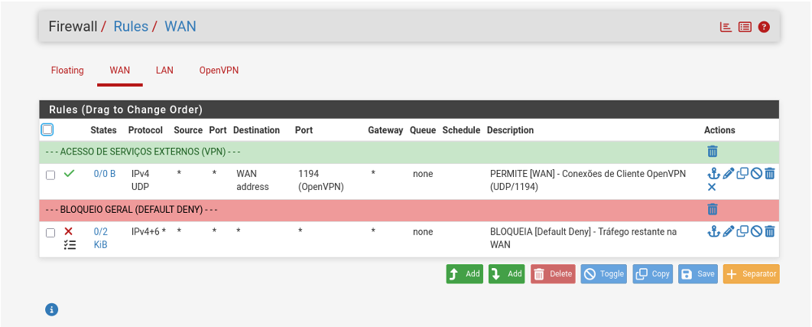

---

#### Regras de Firewall da Interface LAN

As regras implementadas na interface **LAN** foram projetadas para controlar o acesso dos usuários internos aos serviços locais e externos.

O acesso administrativo ao **pfSense** foi restrito exclusivamente aos administradores previamente autorizados. Apenas os endereços IP definidos no alias **admin_redes** podem acessar a interface de gerenciamento via **HTTP (80)**, **HTTPS (443)** e **SSH (22)**.

Além disso, foram liberados os principais serviços necessários para o funcionamento da rede, permitindo que os dispositivos da LAN acessem a internet por meio dos protocolos **HTTP**, **HTTPS** e **DNS**.

Também foi autorizada a utilização do protocolo **ICMP** para testes de conectividade, restringindo-se aos tipos **Echo Request** e **Echo Reply**, permitindo a realização de diagnósticos sem comprometer a segurança da infraestrutura.

A organização das regras de firewall aplicadas à interface **LAN** é apresentada na figura abaixo.

**Figura 10 – Regras de firewall da interface LAN no pfSense.**

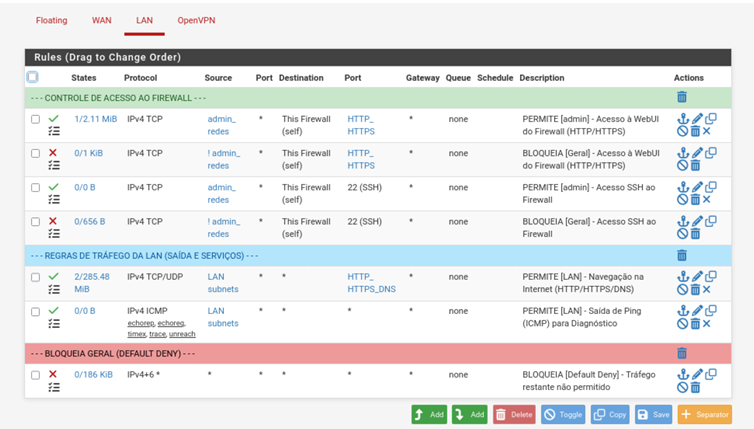

---

#### Regras de Firewall da Interface OpenVPN

A interface **OpenVPN** possui um conjunto específico de regras destinado ao controle do tráfego proveniente dos usuários conectados à VPN.

O acesso administrativo ao **pfSense** foi permitido exclusivamente aos administradores de rede cujos endereços IP pertencem ao alias **admin_vpn**, autorizando conexões às interfaces de gerenciamento via **HTTP (80)**, **HTTPS (443)** e **SSH (22)**.

Para os usuários conectados à VPN, foram liberados os serviços essenciais de navegação (**HTTP**, **HTTPS** e **DNS**), permitindo o acesso à internet por meio do firewall.

Também foram implementadas regras para permitir tráfego **ICMP**, possibilitando a realização de testes de conectividade entre a rede VPN, a rede interna e a internet.

Por fim, foi criada uma regra permitindo o acesso remoto ao servidor de arquivos da rede interna utilizando o protocolo **SMB**, por meio da porta **445**, definida no alias **porta_SMB**.

A configuração das regras de firewall da interface **OpenVPN** é apresentada na figura abaixo.

**Figura 11 – Regras de firewall da interface OpenVPN no pfSense.**

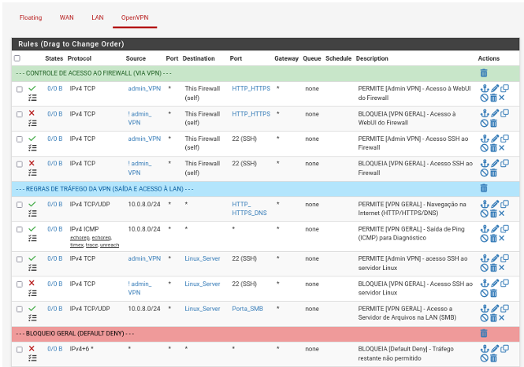

---

#### Configuração do Servidor OpenVPN

O servidor OpenVPN foi configurado utilizando o modo **Remote Access (SSL/TLS + User Authentication)**, permitindo o acesso remoto seguro à rede por meio de autenticação baseada em certificados digitais e autenticação multifator (MFA) integrada ao FreeRADIUS.

##### Principais configurações

- **Modo:** Remote Access (SSL/TLS + User Authentication)
- **Protocolo:** UDP
- **Porta:** 1194
- **Modo do túnel:** TUN (Layer 3)
- **Rede VPN:** 10.0.8.0/24
- **IPv6:** Desabilitado
- **Redirect IPv4 Gateway:** Habilitado
- **Inter-client Communication:** Desabilitado
- **Duplicate Connections:** Desabilitado
- **Strict User-CN Matching:** Habilitado

Essas configurações estabelecem um túnel VPN seguro, garantem que todo o tráfego IPv4 dos clientes passe pelo firewall e impedem a comunicação direta entre clientes conectados, reduzindo a superfície de ataque.

**Figura 12 – Servidor OpenVPN configurado** 

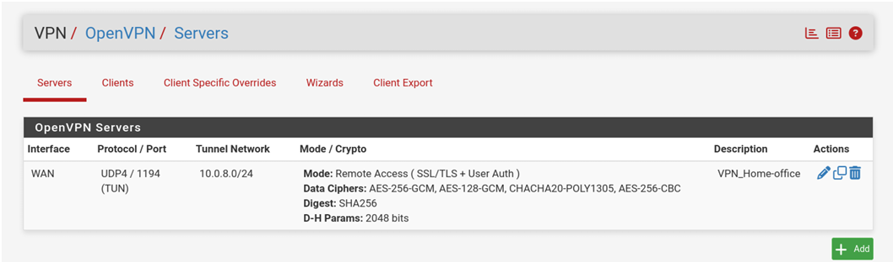

##### Autenticação

A autenticação dos clientes VPN foi implementada por meio da integração entre o **OpenVPN** e o **FreeRADIUS**, que atua como servidor de autenticação centralizada. Essa integração permite validar as credenciais dos usuários e implementar autenticação multifator (MFA), aumentando significativamente a segurança do acesso remoto.

A solução foi composta pelos seguintes mecanismos:

- Certificados digitais individuais emitidos para cada usuário;
- Autenticação centralizada pelo **FreeRADIUS** utilizando o protocolo **RADIUS**;
- Autenticação baseada em **TOTP (Time-based One-Time Password)** por meio do Google Authenticator;
- PIN de 4 dígitos combinado com um código temporário de 6 dígitos gerado pelo aplicativo Google Authenticator.

##### Configuração do FreeRADIUS

Após a instalação do pacote **FreeRADIUS** no pfSense, foi configurado um servidor RADIUS para atender às requisições de autenticação do OpenVPN.

As principais configurações utilizadas foram:

- **Interface IP Address:** `127.0.0.1`
- **Authentication Port:** `1812`
- **Authentication Method:** PAP

O endereço de loopback (`127.0.0.1`) foi utilizado para restringir as requisições RADIUS ao próprio pfSense, aumentando a segurança da solução. Em seguida, foram cadastrados os usuários que utilizariam a VPN, sendo gerados automaticamente uma chave secreta e um QR Code para configuração do Google Authenticator.

**Figura 13 – Porta 1812 configurada para autenticação no FreeRADIUS**

**Figura 14 – Usuários cadastrados FreeRADIUS**

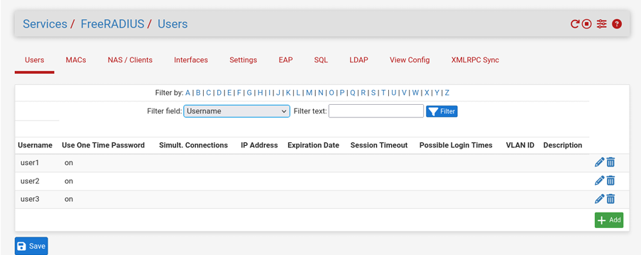

**Figura 15 - QR Code para configuração do TOTP no Google Authenticator**

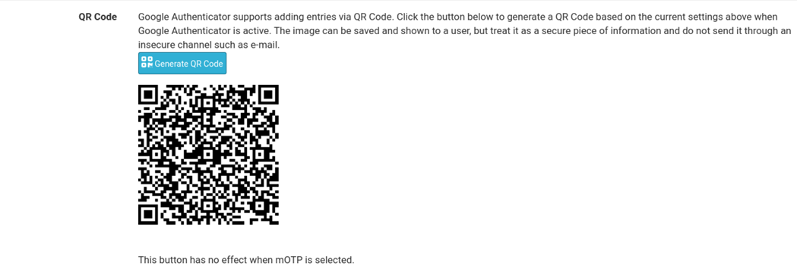

**Figura 16 - Códigos temporários gerados no Google Authenticator**

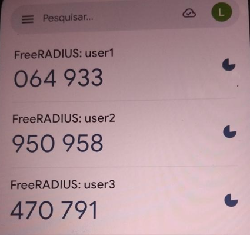

##### Exportação dos clientes

Os arquivos `.ovpn` foram gerados utilizando o pacote **OpenVPN Client Export**, contendo certificados e parâmetros necessários para conexão.

##### Revogação de certificados

Foi validado o processo de revogação de certificados, impedindo imediatamente novas conexões de usuários revogados.

##### Client Specific Overrides

Foram configurados IPs estáticos para usuários administrativos, facilitando a criação de regras de firewall e auditoria.

## Resultados

A implementação demonstrou que é possível construir uma infraestrutura de segurança para pequenas empresas utilizando soluções de código aberto, reduzindo custos de implantação sem comprometer os requisitos básicos de proteção da rede.

---

## Autor

**Leandro Lima**

🎓 Tecnólogo em Redes de Computadores | Instituto Federal do Rio Grande do Norte (IFRN)