# Segurança de Redes com pfSense

### Implementação de Firewall, VPN e Autenticação Multifator com FreeRADIUS e Google Authenticator

## Sobre o projeto

Este repositório reúne a documentação, imagens e demais materiais utilizados no desenvolvimento do meu Trabalho de Conclusão de Curso (TCC) do curso de Tecnologia em Redes de Computadores.

## Contextualização

As pequenas empresas frequentemente enfrentam dificuldades para implantar soluções robustas de segurança da informação devido às limitações orçamentárias e à escassez de recursos técnicos especializados. Como consequência, muitas operam com mecanismos de proteção insuficientes, tornando-se mais vulneráveis a ameaças como acessos não autorizados, vazamento de dados, malware e outros ataques cibernéticos.

Além disso, o crescimento do trabalho remoto e híbrido durante e após a pandemia de COVID-19 ampliou a necessidade de acesso seguro aos recursos corporativos.  Mesmo após o período mais crítico da pandemia, esse modelo de trabalho permaneceu sendo adotado por diversas organizações, aumentando a importância de soluções que permitam conexões remotas protegidas e um controle de acesso mais seguro à infraestrutura de rede.

Nesse contexto, este projeto apresenta a implementação, em um **ambiente de laboratório virtualizado**, de uma solução de segurança de baixo custo para pequenas empresas utilizando o **pfSense** como firewall principal. A solução contempla a configuração do **OpenVPN** para acesso remoto seguro com **autenticação multifator (MFA)**, por meio da integração entre **FreeRADIUS** e **Google Authenticator**. A proposta busca demonstrar como ferramentas de código aberto podem fortalecer a segurança da infraestrutura de rede sem exigir investimentos elevados em licenciamento de software, oferecendo uma alternativa acessível e eficiente para organizações com recursos financeiros limitados.

---

## Objetivos

- Montar um ambiente virtualizado simulando uma infraestrutura básica de uma pequena empresa.
- Configurar regras para controle de tráfego no pfSense.
- Implantar acesso remoto seguro por meio do OpenVPN e autenticação multifator.
- Validar a solução por meio de testes práticos.

---

## Ambiente de testes

### Hardware

- Notebook Intel Core i3
- 8 GB de memória RAM
- Sistema operacional Windows 11

## Tecnologias, sistemas e softwares utilizados

- pfSense CE
- OpenVPN
- FreeRADIUS
- Google Authenticator
- VirtualBox
- Kali Linux
- Windows 10
- Linux Lubuntu
- Linux Debian
- Nmap
- Netcat

## Implementações

Para iniciar a implementação, foi realizada a criação do ambiente virtualizado no VirtualBox. A máquina virtual do **pfSense** foi configurada com duas interfaces de rede: a primeira interface, destinada à **WAN**, foi configurada em modo **Bridge** para permitir o acesso à internet através da rede existente; a segunda interface, destinada à **LAN**, foi configurada utilizando o modo **Rede Interna**, responsável pela comunicação entre os dispositivos do ambiente de laboratório.

Na rede interna foram criadas máquinas virtuais para representar diferentes cenários de uma infraestrutura corporativa. A VM **Linux-Cliente-Desktop** foi utilizada para simular uma estação de trabalho pertencente à rede local, representando um usuário administrador. O **Kali Linux** foi inserido no ambiente interno para realização de testes de segurança e validação das regras de firewall implementadas no pfSense.

Também foi configurado um servidor **Debian** para simular um servidor corporativo localizado dentro da rede LAN, disponibilizando serviços como **Apache** e **Samba**. Esse servidor foi utilizado para validar o acesso remoto aos serviços internos através da conexão VPN.

Por fim, foram criadas máquinas virtuais com sistemas **Windows** e **Linux** configuradas em modo **Bridge**, simulando dispositivos externos que realizam conexões remotas à rede interna por meio da VPN.

A relação das máquinas virtuais criadas e suas respectivas configurações básicas é apresentada na tabela abaixo.

**Figura 01 – Tabela das máquinas virtuais do laboratório.**

---

### Topologia da infraestrutura virtual implementada

**Figura 02 – Topologia da infraestrutura virtual implementada.**

A infraestrutura foi organizada em três segmentos distintos: **rede interna**, **firewall/roteador** e **rede externa**, conforme apresentado na Figura acima.

A **rede interna (LAN - 192.168.1.0/24)** representa o ambiente corporativo protegido, sendo composta por estações de trabalho, servidores e uma máquina utilizada para simular um agente malicioso.

O **firewall pfSense** atua como ponto central de interconexão entre as redes, sendo responsável pela aplicação das políticas de filtragem, tradução de endereços (NAT), roteamento e gerenciamento dos serviços de segurança.

Por sua vez, a **rede externa (WAN - 192.168.0.0/24 e VPN - 10.0.8.0/24)** representa a conexão com a internet e os usuários remotos que necessitam acessar recursos internos por meio de conexões VPN seguras. Também foi utilizada uma estação externa para simular ataques originados fora da rede corporativa.

Essa segmentação permite reproduzir cenários reais de acesso remoto, administração de serviços e aplicação de políticas de segurança, possibilitando a realização de testes de validação da arquitetura proposta.

---

### Configurações Iniciais do pfSense

Após a instalação do **pfSense**, foram realizadas as configurações iniciais da infraestrutura de rede.

As interfaces **WAN** e **LAN** foram configuradas com endereços IP estáticos, conforme o esquema de endereçamento definido para o ambiente de laboratório:

- **WAN:** `192.168.0.5/24`
- **LAN:** `192.168.1.1/24`

Além disso, a interface de gerenciamento **WebConfigurator** foi configurada para aceitar conexões exclusivamente pela interface **LAN**, ficando disponível no endereço `https://192.168.1.1`. Essa configuração restringe o acesso administrativo à rede interna, reduzindo a exposição da interface de gerenciamento.

As configurações iniciais das interfaces **WAN** e **LAN** são apresentadas na figura abaixo.

**Figura 03 – Configuração iniciais do pfSense nas interfaces WAN e LAN.**

Após a configuração das interfaces de rede, o gerenciamento do firewall passou a ser realizado por meio da interface web (**WebConfigurator**), acessível através da rede LAN.

**Figura 04 – Tela inicial do WebConfigurator do pfSense.**

---

### Plano de endereçamento IP

Inicialmente, foi definido o esquema de endereçamento da rede local. Para isso, foram configuradas no servidor **DHCP** reservas de endereços IP para as máquinas **Linux-Server-Empresa** e **Linux-Cliente-Desktop**, além de alguns endereços adicionais destinados à utilização como IPs estáticos.

O intervalo de endereços estáticos da rede foi definido entre **192.168.1.1** (gateway padrão) e **192.168.1.5/24**. O servidor **DHCP** foi configurado para distribuir endereços IP dinamicamente no intervalo de **192.168.1.6** a **192.168.1.254**, utilizando máscara de sub-rede **/24**.

Essa estratégia simplifica o gerenciamento da infraestrutura, facilita a criação de regras de firewall e permite a identificação consistente dos dispositivos presentes na rede. As configurações realizadas são ilustradas nas figuras abaixo.

**Figura 05 – Reservas de endereços IP estáticos.**

**Figura 06 – Configuração do intervalo de endereços DHCP.**

---

### Adequação do Ambiente de Testes

Em razão da utilização de um ambiente de laboratório totalmente virtualizado e baseado exclusivamente em endereços IP privados, foi necessário ajustar algumas configurações padrão do **pfSense** para garantir o correto funcionamento da infraestrutura.

Para isso, foram desabilitadas as opções **Block private networks and loopback addresses** e **Block bogon networks** nas interfaces **WAN** e **LAN**, conforme apresentado na Figura abaixo.

Essas configurações, habilitadas por padrão no pfSense, têm como objetivo impedir o tráfego proveniente de redes privadas e de endereços classificados como *bogon* em ambientes de produção. No entanto, como o ambiente de testes utiliza apenas redes privadas para simular uma infraestrutura corporativa, a desativação temporária dessas opções foi necessária para permitir a comunicação entre as máquinas virtuais.

**Figura 07 – Desabilitando bloqueio de endereços privados.**

---

### Implementação das regras de firewall

#### Configuração de Aliases

Com o objetivo de aumentar a legibilidade e facilitar a manutenção das políticas de segurança, foram criados **aliases** para agrupar endereços IP, redes e portas utilizados pelas regras de firewall. Essa abordagem é considerada uma boa prática, pois permite alterações centralizadas sem a necessidade de modificar individualmente cada regra associada.

Os seguintes aliases foram configurados:

- **admin_redes**: endereços IP das máquinas dos administradores de rede;
- **admin_vpn**: endereços IP fixos atribuídos aos administradores conectados via VPN;
- **HTTP_HTTPS**: portas **80** (HTTP) e **443** (HTTPS);
- **HTTP_HTTPS_DNS**: portas **80** (HTTP), **443** (HTTPS) e **53** (DNS);
- **Linux_server**: endereço IP do servidor Linux;
- **porta_SMB**: porta **445**, utilizada pelo protocolo SMB para compartilhamento de arquivos.

A configuração dos aliases no **pfSense** é apresentada na figura abaixo.

**Figura 08 – Aliases configurados no pfSense.**

---

#### Política de Segurança Implementada

A política de segurança adotada neste projeto foi estruturada com base em dois princípios fundamentais:

- **Princípio do menor privilégio:** somente o tráfego estritamente necessário é permitido, restringindo o acesso aos serviços essenciais.
- **Política de negação por padrão (*default deny*):** todo tráfego que não esteja explicitamente autorizado pelas regras de firewall é bloqueado automaticamente.

A adoção desses princípios reduz a superfície de ataque da infraestrutura, minimiza a exposição de serviços críticos e contribui para um ambiente de rede mais seguro. Dessa forma, apenas comunicações previamente autorizadas podem atravessar o firewall, reforçando o controle de acesso e a proteção dos recursos da rede.

---

#### Regras de Firewall da Interface WAN

A interface **WAN** representa o principal ponto de exposição da infraestrutura à Internet. Em razão disso, optou-se por restringir ao máximo os serviços acessíveis externamente.

A única exceção corresponde ao serviço **OpenVPN**, disponibilizado por meio da porta **UDP 1194**. Sua implementação é essencial para viabilizar o acesso remoto seguro à rede interna por meio de um túnel criptografado.

Todos os demais acessos provenientes da Internet são bloqueados automaticamente pela política de **negação por padrão (*default deny*)**, reduzindo significativamente os riscos associados à exposição desnecessária de serviços administrativos e aplicações internas.

A configuração das regras de firewall da interface **WAN** é apresentada na figura abaixo.

**Figura 09 – Regras de firewall da interface WAN no pfSense.**

---

#### Regras de Firewall da Interface LAN

As regras implementadas na interface **LAN** foram projetadas para controlar o acesso dos usuários internos aos serviços locais e externos.

O acesso administrativo ao **pfSense** foi restrito exclusivamente aos administradores previamente autorizados. Apenas os endereços IP definidos no alias **admin_redes** podem acessar a interface de gerenciamento via **HTTP (80)**, **HTTPS (443)** e **SSH (22)**.

Além disso, foram liberados os principais serviços necessários para o funcionamento da rede, permitindo que os dispositivos da LAN acessem a internet por meio dos protocolos **HTTP**, **HTTPS** e **DNS**.

Também foi autorizada a utilização do protocolo **ICMP** para testes de conectividade, restringindo-se aos tipos **Echo Request** e **Echo Reply**, permitindo a realização de diagnósticos sem comprometer a segurança da infraestrutura.

A organização das regras de firewall aplicadas à interface **LAN** é apresentada na figura abaixo.

**Figura 10 – Regras de firewall da interface LAN no pfSense.**

---

#### Regras de Firewall da Interface OpenVPN

A interface **OpenVPN** possui um conjunto específico de regras destinado ao controle do tráfego proveniente dos usuários conectados à VPN.

O acesso administrativo ao **pfSense** foi permitido exclusivamente aos administradores de rede cujos endereços IP pertencem ao alias **admin_vpn**, autorizando conexões às interfaces de gerenciamento via **HTTP (80)**, **HTTPS (443)** e **SSH (22)**.

Para os usuários conectados à VPN, foram liberados os serviços essenciais de navegação (**HTTP**, **HTTPS** e **DNS**), permitindo o acesso à internet por meio do firewall.

Também foram implementadas regras para permitir tráfego **ICMP**, possibilitando a realização de testes de conectividade entre a rede VPN, a rede interna e a internet.

Por fim, foi criada uma regra permitindo o acesso remoto ao servidor de arquivos da rede interna utilizando o protocolo **SMB**, por meio da porta **445**, definida no alias **porta_SMB**.

A configuração das regras de firewall da interface **OpenVPN** é apresentada na figura abaixo.

**Figura 11 – Regras de firewall da interface OpenVPN no pfSense.**

---

### Configuração do Servidor OpenVPN

O servidor OpenVPN foi configurado utilizando o modo **Remote Access (SSL/TLS + User Authentication)**, permitindo o acesso remoto seguro à rede por meio de autenticação baseada em certificados digitais e autenticação multifator (MFA) integrada ao FreeRADIUS.

#### Principais configurações

- **Modo:** Remote Access (SSL/TLS + User Authentication)
- **Protocolo:** UDP
- **Porta:** 1194
- **Modo do túnel:** TUN (Layer 3)
- **Rede VPN:** 10.0.8.0/24
- **IPv6:** Desabilitado
- **Redirect IPv4 Gateway:** Habilitado
- **Inter-client Communication:** Desabilitado
- **Duplicate Connections:** Desabilitado
- **Strict User-CN Matching:** Habilitado

Essas configurações estabelecem um túnel VPN seguro, garantem que todo o tráfego IPv4 dos clientes passe pelo firewall e impedem a comunicação direta entre clientes conectados, reduzindo a superfície de ataque.

**Figura 12 – Servidor OpenVPN configurado** 

#### Autenticação

A autenticação dos clientes VPN foi implementada por meio da integração entre o **OpenVPN** e o **FreeRADIUS**, que atua como servidor de autenticação centralizada. Essa integração permite validar as credenciais dos usuários e implementar autenticação multifator (MFA), aumentando significativamente a segurança do acesso remoto.

A solução foi composta pelos seguintes mecanismos:

- Certificados digitais individuais emitidos para cada usuário;
- Autenticação centralizada pelo **FreeRADIUS** utilizando o protocolo **RADIUS**;
- Autenticação baseada em **TOTP (Time-based One-Time Password)** por meio do Google Authenticator;
- PIN de 4 dígitos combinado com um código temporário de 6 dígitos gerado pelo aplicativo Google Authenticator.

#### Configuração do FreeRADIUS

Após a instalação do pacote **FreeRADIUS** no pfSense, foi configurado um servidor RADIUS para atender às requisições de autenticação do OpenVPN.

As principais configurações utilizadas foram:

- **Interface IP Address:** `127.0.0.1`
- **Authentication Port:** `1812`
- **Authentication Method:** PAP

O endereço de loopback (`127.0.0.1`) foi utilizado para restringir as requisições RADIUS ao próprio pfSense, aumentando a segurança da solução. Em seguida, foram cadastrados os usuários que utilizariam a VPN, sendo gerados automaticamente uma chave secreta e um QR Code para configuração do Google Authenticator.

**Figura 13 – Porta 1812 configurada para autenticação no FreeRADIUS**

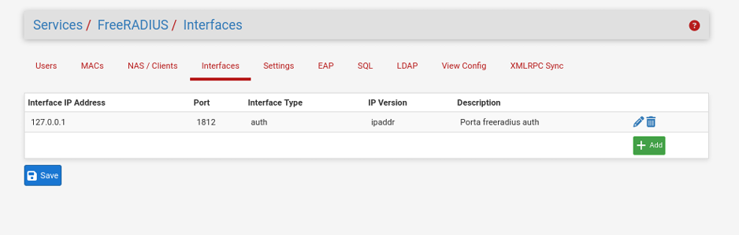

**Figura 14 – Usuários cadastrados FreeRADIUS**

**Figura 15 - QR Code para configuração do TOTP no Google Authenticator**

**Figura 16 - Códigos temporários gerados no Google Authenticator**

---

#### Fluxo de autenticação

Após a configuração do OpenVPN e do FreeRADIUS, o processo de autenticação passou a ocorrer de forma centralizada. O **pfSense** atua como intermediário entre o cliente OpenVPN e o servidor **FreeRADIUS**, responsável por validar as credenciais do usuário e o segundo fator de autenticação.

O processo ocorre conforme o fluxo abaixo:

1. O usuário inicia a conexão utilizando o cliente OpenVPN.
2. O cliente apresenta seu certificado digital ao servidor OpenVPN.
3. O OpenVPN valida o certificado e verifica sua autenticidade por meio da Autoridade Certificadora (CA), além de confirmar a correspondência entre o certificado e o usuário autenticado (**Strict User-CN Matching**).
4. O usuário informa seu nome de usuário e, no campo **Password**, a combinação do **PIN de 4 dígitos** com o **código TOTP de 6 dígitos** gerado pelo Google Authenticator.
5. O pfSense encaminha essas credenciais ao FreeRADIUS utilizando o protocolo **RADIUS**.
6. O FreeRADIUS valida o nome de usuário, o PIN e o código temporário (TOTP).
7. Em caso de sucesso, o FreeRADIUS retorna uma resposta **Access-Accept** ao OpenVPN.
8. O OpenVPN estabelece o túnel VPN, atribui ao cliente um endereço IP da rede **10.0.8.0/24** e aplica as regras de firewall configuradas.
9. Caso qualquer etapa da autenticação falhe, o FreeRADIUS retorna **Access-Reject**, e a conexão é imediatamente encerrada.

Esse processo garante que somente usuários autorizados, portando um certificado digital válido e um código temporário gerado pelo Google Authenticator, consigam estabelecer uma conexão segura com a VPN.

---

#### Emissão de certificados dos clientes

Após a configuração do servidor OpenVPN, foram emitidos certificados digitais individuais para os usuários **user1**, **user2** e **user3**, todos assinados pela Autoridade Certificadora (CA) da VPN. Cada certificado identifica exclusivamente seu respectivo usuário, garantindo a autenticidade durante o processo de conexão e permitindo a revogação individual de acessos quando necessário.

**Figura 17 - Certificados dos clientes OpenVPN**

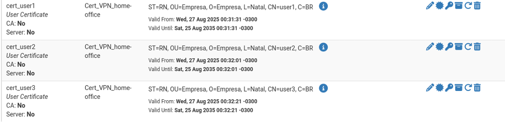

---

#### Exportação dos clientes OpenVPN

Após a emissão dos certificados digitais, foi utilizado o pacote **OpenVPN Client Export** para gerar os perfis de configuração dos clientes. Os arquivos exportados no formato `.ovpn` reúnem todas as informações necessárias para estabelecer a conexão VPN, incluindo o certificado do cliente, a chave privada, o certificado da Autoridade Certificadora (CA) e os parâmetros de configuração do servidor.

Esses arquivos podem ser importados diretamente em clientes compatíveis com o OpenVPN, simplificando o processo de configuração e reduzindo a possibilidade de erros durante a implantação.

**Figura 18 - Certificados dos clientes OpenVPN disponíveis para uso**

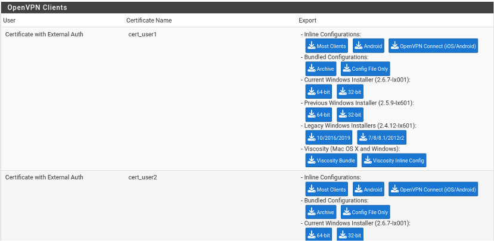

---

#### Revogação de certificados

Como mecanismo adicional de controle de acesso, foi realizado o procedimento de **revogação de certificados**, permitindo invalidar imediatamente o acesso de usuários à VPN em situações como comprometimento de credenciais, perda de dispositivos ou desligamento da organização.

Para validar esse recurso, o certificado do usuário **user3** foi revogado no pfSense. Após a revogação, novas tentativas de conexão utilizando esse certificado passaram a ser rejeitadas pelo servidor OpenVPN, impedindo o estabelecimento da VPN mesmo que o usuário possuísse o arquivo de configuração `.ovpn`.

**Figura 19 – Revogação de certificados no pfSense**

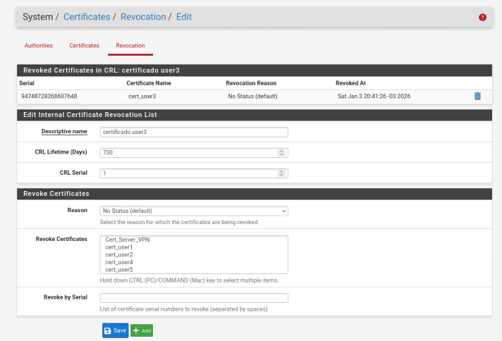

#### Client Specific Overrides

Por fim, foram configurados **Client Specific Overrides** para os usuários administradores, permitindo associar endereços IP estáticos aos respectivos certificados digitais.

Essa funcionalidade garante que cada usuário receba sempre o mesmo endereço IP ao estabelecer a conexão VPN, facilitando a implementação de regras de firewall, auditoria, monitoramento e controle de acesso baseados na identidade do usuário.

**Figura 20 – Client Specific Overrides configurado**

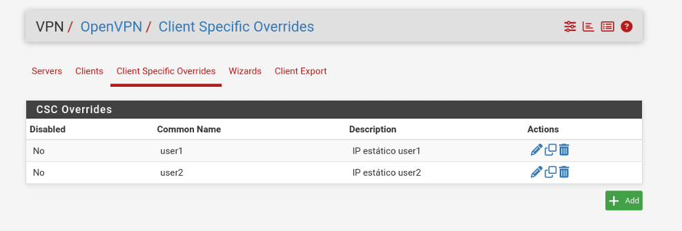

## Validação da Solução Proposta

A validação da solução proposta foi realizada por meio de testes funcionais e de segurança destinados a verificar a efetividade das políticas implementadas no firewall, o funcionamento do serviço VPN e a autenticação multifator.

Os experimentos buscaram avaliar o comportamento da infraestrutura diante de diferentes cenários de acesso autorizado e não autorizado, permitindo verificar sua aderência aos requisitos de segurança definidos para pequenas empresas.

---

### Testes de Firewall

Os testes de firewall tiveram como objetivo validar o correto funcionamento das regras de filtragem configuradas no pfSense, analisando seu comportamento diante de diferentes cenários de tráfego permitido e bloqueado, bem como o controle de acesso administrativo e a aplicação da política de bloqueio por padrão (**default deny**).

---

#### Teste de Firewall - Interface WAN

A interface WAN controla o tráfego de entrada proveniente da Internet, sendo o principal ponto de exposição do firewall.

Nesse contexto, foram realizados testes com o objetivo de validar esse controle, verificando se apenas os serviços autorizados estavam acessíveis externamente, enquanto as demais tentativas de acesso eram devidamente bloqueadas.

---

##### Teste 1 - Bloqueio de acesso externo a serviços não autorizados (**default deny**)

Foi realizado um teste de conexão a partir de um host externo, utilizando o sistema Kali Linux (IP `192.168.0.8`), em direção à interface WAN do pfSense (IP `192.168.0.5`).

O objetivo do experimento foi verificar o funcionamento da política de bloqueio padrão (**default deny**) diante de uma tentativa de acesso a uma porta TCP que não possuía regra de liberação configurada.

Para a realização do teste, foi utilizada a ferramenta **Netcat (nc)**, que tentou estabelecer uma conexão TCP na porta `4444` da interface WAN do firewall.

Como não existia nenhuma regra permitindo explicitamente o tráfego para essa porta, esperava-se que a conexão fosse bloqueada pelo pfSense.

Os resultados confirmaram o comportamento esperado. A tentativa de conexão não foi concluída e retornou a mensagem: **connection timed out** indicando que o acesso foi impedido.

**Figura 21 – Tráfego bloqueado pela política default deny na interface WAN**

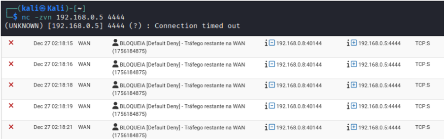

---

##### Teste 2 - Acesso permitido ao serviço OpenVPN na interface WAN

Foi realizado um teste de conexão externa a partir de um host Kali Linux (IP `192.168.0.8`) em direção à interface WAN do pfSense (IP `192.168.0.5`), com foco na porta `1194/UDP`.

O objetivo do experimento foi verificar se a porta utilizada pelo serviço OpenVPN, previamente liberada por meio de uma regra específica no firewall, estava acessível a partir da rede externa.

Para a realização do teste, foi utilizada a ferramenta **Nmap**, configurada para analisar exclusivamente essa porta e confirmar seu estado de acessibilidade.

O resultado obtido demonstrou que a porta `1194/UDP` encontra-se acessível externamente, conforme previsto pela configuração do firewall.

**Figura 22 –  Escaneamento da porta 1194/UDP na interface WAN com Nmap**

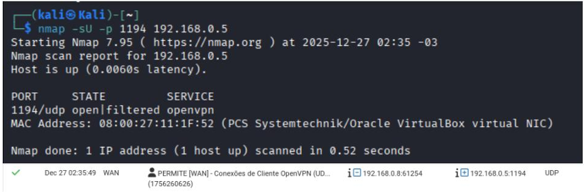

O comportamento observado confirma o correto funcionamento da regra de liberação criada na interface WAN para o serviço OpenVPN, permitindo o tráfego legítimo destinado à aplicação.

---

#### Testes de Firewall - Interface LAN

A interface LAN controla o tráfego de saída originado na rede interna, onde normalmente se pressupõe um ambiente confiável.

Contudo, sob a perspectiva de segurança, também foi considerado o cenário em que um possível atacante obtém acesso à rede local.

Nesse contexto, foram realizados testes com o objetivo de validar tanto o controle do tráfego destinado à Internet quanto o acesso a recursos internos, especialmente ao próprio firewall pfSense, verificando a eficácia das regras de restrição implementadas.

---

##### Teste 1 - Bloqueio de tráfego de saída não autorizado

Foi realizado um teste de conexão a partir de um host interno da rede local, denominado **Linux Cliente** (IP `192.168.1.3`), em direção a um host externo, **Kali Linux** (IP `192.168.0.8`).

O objetivo do experimento foi avaliar o comportamento do firewall da interface LAN diante de uma tentativa de conexão de saída para uma porta TCP que não possuía regra de permissão explicitamente configurada.

Para a realização do teste, o host Kali Linux foi configurado para permanecer em escuta na porta `4444/TCP` utilizando a ferramenta **Netcat**.

Em seguida, o host interno tentou estabelecer uma conexão com esse serviço, também por meio do Netcat, permitindo verificar se o tráfego seria autorizado ou bloqueado pelo firewall.

Os resultados demonstraram que a conexão não foi estabelecida.

**Figura 23 –  Bloqueio de tráfego de saída não autorizado porta 4444**

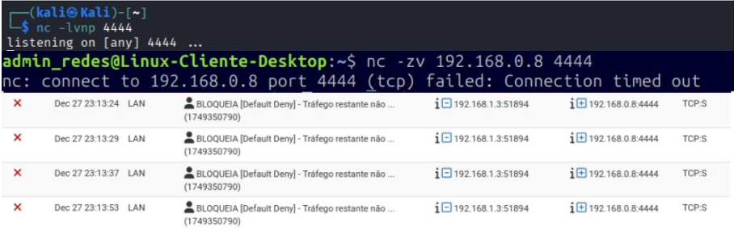

A análise dos registros do pfSense confirmou que o tráfego foi bloqueado pela política de negação padrão aplicada à interface LAN.

Esse comportamento evidencia a efetividade da política **default deny**, garantindo que conexões para serviços ou portas não explicitamente autorizados sejam bloqueadas.

---

##### Teste 2 - Controle de acesso administrativo ao pfSense na LAN

Foi realizado um conjunto de testes para avaliar o controle de acesso administrativo ao pfSense por meio da interface LAN.

O objetivo foi verificar se apenas os hosts previamente autorizados conseguem acessar a interface web de gerenciamento e o serviço SSH do firewall, conforme definido pelas regras de segurança configuradas.

Para a execução dos testes, foram utilizados:

- **Host administrativo:** IP `192.168.1.3`
- **Host interno não autorizado:** IP `192.168.1.6`

O host administrativo realizou o acesso à interface web do pfSense por meio de um navegador utilizando o protocolo HTTPS (`porta 443/TCP`) e também ao serviço SSH (`porta 22/TCP`).

Paralelamente, o host não autorizado tentou acessar os mesmos serviços utilizando a ferramenta **Netcat**, com o objetivo de verificar se as restrições configuradas seriam corretamente aplicadas.

Os resultados demonstraram que tanto a interface web de gerenciamento quanto o serviço SSH estavam acessíveis exclusivamente ao host administrativo.

**Figura 24 – Acesso permitido a interface web e via SSH do pfSense pelo host administrativo**

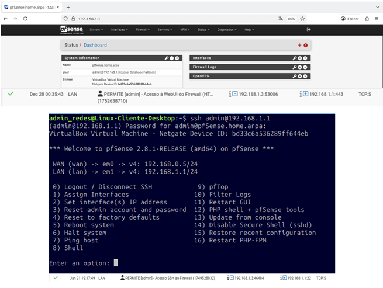

Em contrapartida, as tentativas de acesso realizadas a partir do host não autorizado foram bloqueadas.

**Figura 25 – Bloqueio de acesso à web e SSH do pfSense a partir do host não administrativo**

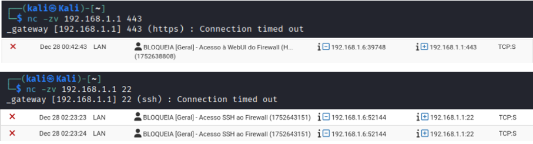

A análise dos registros do pfSense confirmou que as conexões foram tratadas de acordo com as regras de controle de acesso configuradas na interface LAN, comprovando a eficácia dos mecanismos de restrição implementados para proteger os serviços administrativos do firewall.

---

##### Teste 3 - Acesso à Internet para a rede interna

Foi realizado um teste de acesso à Internet a partir de um host pertencente à rede interna, identificado pelo endereço IP `192.168.1.3`.

O objetivo do experimento foi avaliar o comportamento das regras de firewall configuradas na interface LAN do pfSense em relação à permissão de tráfego de saída destinado à Internet.

Para a execução do teste, foi utilizado um navegador web instalado no host interno, por meio do qual foi realizado o acesso ao endereço externo: **google.com**

A atividade teve como finalidade verificar se o tráfego originado na rede local seria encaminhado corretamente pelo firewall, de acordo com as regras estabelecidas para a interface LAN.

Os resultados demonstraram que a navegação foi realizada com sucesso.

**Figura 26 – Navegação na internet permitida para a rede interna**

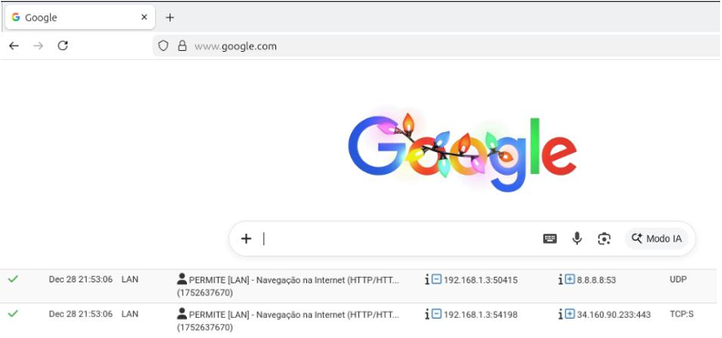

O acesso ao endereço externo ocorreu sem restrições, confirmando que as regras de firewall configuradas permitem a comunicação dos hosts da rede interna com a Internet.

Além disso, a análise dos registros do pfSense confirmou a liberação do tráfego de saída em conformidade com as políticas definidas para a interface LAN, validando o correto funcionamento da configuração implementada.

---

#### Teste de Firewall - Interface OpenVPN

A interface OpenVPN permite o acesso remoto à rede interna por meio de um túnel VPN.

As regras implementadas diferenciam usuários administrativos de usuários comuns, garantindo acesso apenas aos recursos necessários, sempre seguindo a política de bloqueio por padrão (**default deny**).

Diferentemente das interfaces WAN e LAN, não foram realizados testes com Nmap nem utilizado o Kali Linux, pois o acesso à VPN exige autenticação reforçada por múltiplos fatores.

Os testes foram direcionados para verificar se:

- usuários autorizados conseguem acessar os serviços permitidos;
- usuários sem privilégios possuem seus acessos bloqueados;
- as regras de firewall da interface OpenVPN funcionam corretamente.

---

##### Teste 1 - Acesso administrativo ao pfSense via VPN (user1)

Foi realizado um teste utilizando um cliente VPN conectado a uma rede doméstica, com o endereço IP `192.168.0.10`, localizado na mesma rede da interface WAN do pfSense.

A conexão com a rede interna foi estabelecida por meio do serviço OpenVPN configurado no firewall, utilizando um perfil administrativo associado ao usuário **user1**.

O objetivo do experimento foi verificar se usuários com privilégios administrativos, conectados remotamente via VPN, conseguem acessar a interface web de gerenciamento e o serviço SSH do pfSense conforme as regras de acesso definidas.

Inicialmente, foi estabelecida uma conexão VPN utilizando as credenciais do usuário **user1**.

Após a autenticação e criação do túnel seguro, foram realizados testes de acesso:

- Interface web do pfSense utilizando HTTPS (`porta 443/TCP`);
- Serviço SSH (`porta 22/TCP`).

Esses procedimentos permitiram validar o funcionamento das regras de firewall aplicadas à interface OpenVPN para usuários administrativos.

Os resultados demonstraram que o usuário **user1** conectou-se com sucesso ao servidor OpenVPN, recebendo o endereço IP: **10.0.8.100/24** no túnel VPN, pertencente ao alias: admin_VPN utilizado nas regras de controle de acesso da interface OpenVPN.

**Figura 27 – Acesso permitido ao pfSense via HTTPS e SSH na VPN para usuário administrador(user1)**

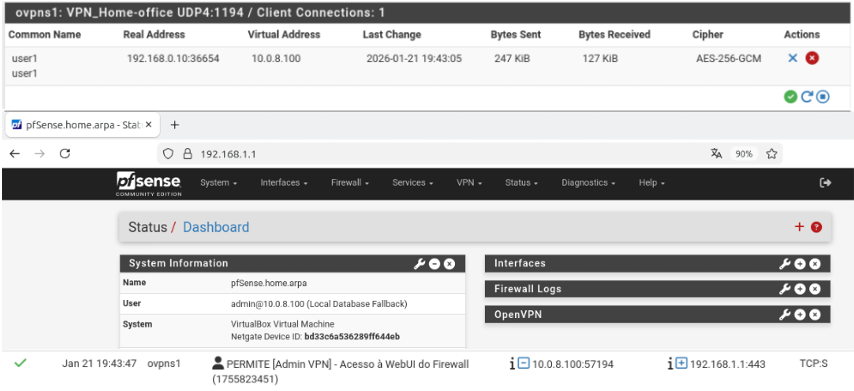

O usuário conseguiu acessar corretamente a interface web de gerenciamento do pfSense por meio do endereço interno: `https://192.168.1.1` utilizando HTTPS (`porta 443/TCP`), bem como estabelecer conexão com o serviço SSH (`porta 22/TCP`).

A análise dos registros do pfSense confirmou que o tráfego originado da interface OpenVPN foi permitido de acordo com as regras de firewall configuradas, comprovando o correto funcionamento do mecanismo de acesso administrativo remoto por VPN.

---

##### Teste 2 - Bloqueio de acesso administrativo ao pfSense via VPN (user3)

Foi realizado um teste para verificar o controle de acesso administrativo ao pfSense por meio da interface OpenVPN, utilizando um usuário VPN que não possui privilégios administrativos.

Nesse cenário, o usuário **user3** estabeleceu conexão com o servidor OpenVPN, porém não pertence ao alias: admin_VPN

utilizado pelas regras de firewall para identificar os usuários autorizados a acessar os serviços administrativos do firewall.

O objetivo do experimento foi validar se usuários VPN sem privilégios administrativos possuem o acesso à interface web de gerenciamento e ao serviço SSH corretamente bloqueado.

Após o estabelecimento da conexão VPN com o usuário **user3**, foram realizadas tentativas de acesso aos serviços administrativos do pfSense utilizando:

- Interface web HTTPS (`porta 443/TCP`);
- Serviço SSH (`porta 22/TCP`).

Para isso, foi utilizada a ferramenta **Netcat (nc)**.

Os resultados demonstraram que o usuário **user3** conectou-se com sucesso ao servidor OpenVPN, recebendo o endereço: 10.0.8.2/24 Entretanto, as tentativas de acesso à interface web e ao serviço SSH não foram concluídas, retornando: connection timed out

Esse comportamento evidencia que, embora o usuário possua acesso à VPN, ele não dispõe das permissões necessárias para acessar os serviços administrativos do firewall.

A análise dos logs do pfSense confirmou que o tráfego foi bloqueado pelas regras da interface OpenVPN, uma vez que o endereço IP atribuído ao usuário não pertence ao alias `admin_VPN`.

**Figura 28 – Teste de acesso à interface Web e SSH do pfSense via VPN com Netcat para usuário não administrador (user3)**

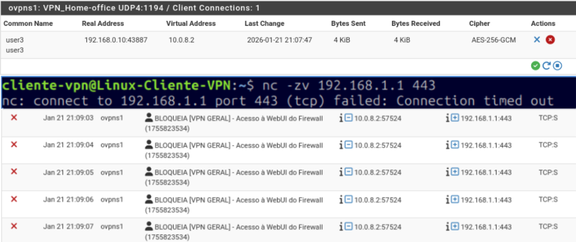

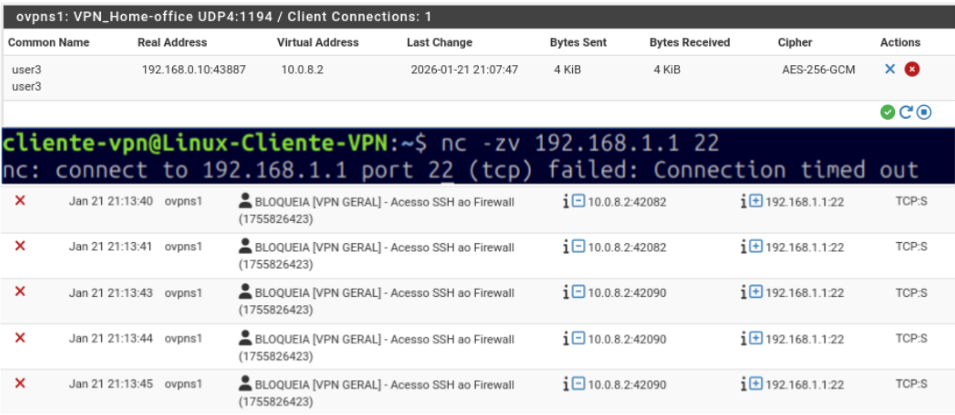

---

##### Teste 3 - Acesso à Internet por usuários conectados via VPN

Foi realizado um teste para avaliar o acesso à Internet por usuários conectados remotamente à rede por meio da interface OpenVPN do pfSense.

A configuração da VPN possuía a opção **Redirect Gateway** habilitada, fazendo com que todo o tráfego de saída dos clientes VPN fosse encaminhado pelo túnel VPN antes de alcançar a Internet.

O objetivo do experimento foi verificar se os usuários conectados via VPN possuíam acesso à Internet de acordo com as regras de firewall configuradas, bem como confirmar que o tráfego era corretamente roteado pelo túnel VPN estabelecido com o pfSense.

Após a conexão dos clientes à VPN, foram realizados testes de navegação utilizando navegadores web instalados no dispositivo do usuário.

O cliente acessou diferentes endereços externos na Internet, permitindo validar o funcionamento do roteamento e das regras de firewall aplicadas à interface OpenVPN.

**Figura 29 – Usuário acessando a internet via VPN**

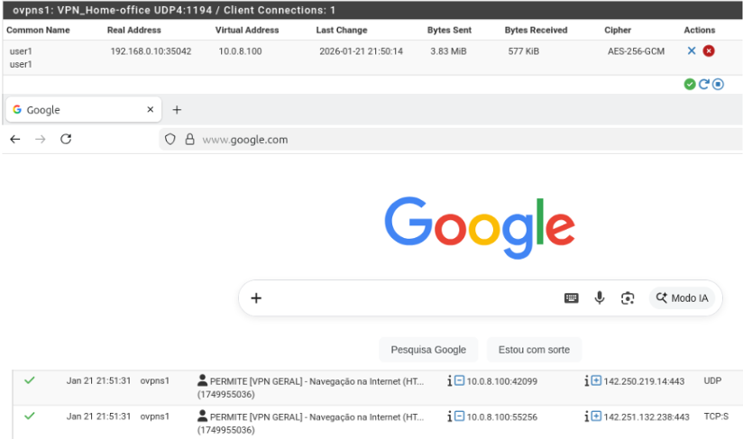

A análise dos registros do firewall confirmou que o tráfego originado da interface OpenVPN foi permitido de acordo com as regras configuradas, comprovando o correto funcionamento da política de acesso à Internet para clientes VPN e validando a operação da opção **Redirect Gateway** no cenário avaliado.

---

##### Teste 4 - Validação da política de bloqueio padrão na interface OpenVPN

Foi realizado um teste para avaliar a aplicação da política de bloqueio por padrão (**default deny**) na interface OpenVPN do pfSense.

O cenário considerou:

- Cliente VPN (**user3**) conectado à rede interna por meio do túnel OpenVPN;
- Servidor Linux interno com endereço IP `192.168.1.2`.

O objetivo do experimento foi verificar se o firewall impediria a passagem de tráfego destinado a serviços que não possuem regras de permissão explicitamente configuradas na interface OpenVPN.

Para a realização do teste, o servidor Linux interno foi configurado para permanecer em escuta na porta: 4444/TCP utilizando uma aplicação de serviço.

Essa porta foi escolhida por não possuir nenhuma regra de liberação associada à interface OpenVPN do pfSense.

Após o estabelecimento da conexão VPN, o usuário **user3** tentou acessar o serviço utilizando a ferramenta **Netcat (nc)**, com o objetivo de verificar se a comunicação seria permitida ou bloqueada pelo firewall.

Os resultados demonstraram que a conexão não foi estabelecida.

**Figura 30 – tráfego bloqueado pela regra default deny na interface OpenVPN**

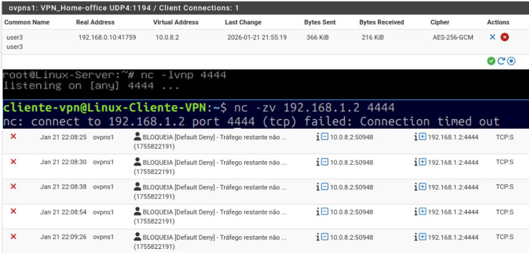

A tentativa de acesso resultou em falha de comunicação, indicando que o tráfego não foi autorizado a atravessar a interface OpenVPN.

A análise dos registros do pfSense confirmou que os pacotes foram bloqueados pela regra de negação padrão aplicada à interface OpenVPN.

Dessa forma, o teste comprovou o correto funcionamento da política **default deny**, garantindo que apenas serviços e portas explicitamente autorizados possam ser acessados por usuários conectados via VPN.

---

##### Teste 5 - Controle de acesso SSH na interface OpenVPN

Foi realizado um teste para validar o controle de acesso ao servidor Linux interno (`192.168.1.2`) por meio do serviço SSH, a partir de usuários conectados via OpenVPN.

O cenário contemplou:

- Usuário administrativo (**user1**);
- Usuário comum (**user3**).

O acesso foi controlado por regras de firewall configuradas na interface OpenVPN do pfSense.

Após o estabelecimento da conexão VPN, ambos os usuários realizaram tentativas de acesso ao serviço SSH do servidor Linux utilizando um cliente SSH e a ferramenta **Netcat (nc)**.

O objetivo foi verificar se apenas usuários autorizados poderiam acessar o serviço administrativo.

Os resultados demonstraram que:

- O usuário administrativo (**user1**) conseguiu estabelecer a conexão SSH com sucesso;
- O usuário comum (**user3**) teve o acesso bloqueado.

**Figura 31 – Acesso permitido user1 administrador ao servidor linux via ssh**

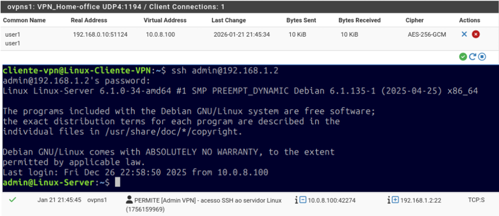

**Figura 32 – Acesso bloqueado user3 comum ao servidor linux via ssh**

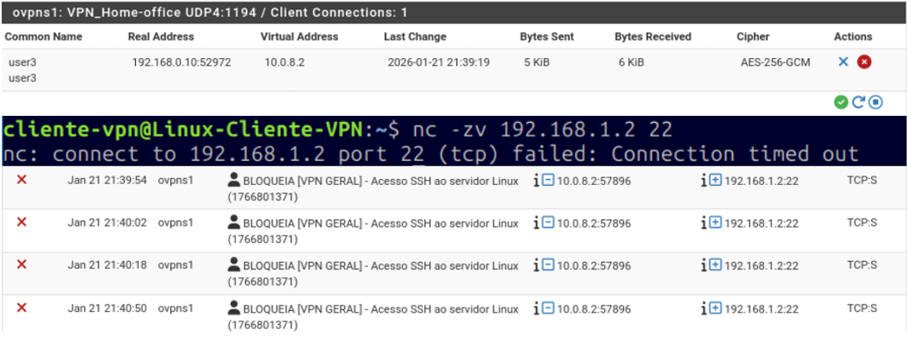

A análise dos registros do pfSense confirmou que o tráfego proveniente da interface OpenVPN foi tratado de acordo com as regras de firewall configuradas, comprovando a correta aplicação das políticas de controle de acesso.

---

## Resultados

A implementação demonstrou que é possível construir uma infraestrutura de segurança para pequenas empresas utilizando soluções de código aberto, reduzindo custos de implantação sem comprometer os requisitos básicos de proteção da rede.

---

## Autor

**Leandro Lima**

🎓 Tecnólogo em Redes de Computadores | Instituto Federal do Rio Grande do Norte (IFRN)