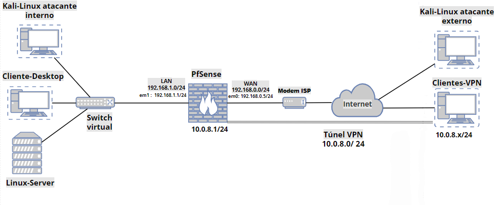

# Segurança de Redes com pfSense

### Implementação de Firewall, VPN e Autenticação Multifator com FreeRADIUS e Google Authenticator

## Sobre o projeto

Este repositório reúne a documentação, imagens e demais materiais utilizados no desenvolvimento do meu Trabalho de Conclusão de Curso (TCC) do curso de Tecnologia em Redes de Computadores.

## Contextualização

As pequenas empresas frequentemente enfrentam dificuldades para implantar soluções robustas de segurança da informação devido às limitações orçamentárias e à escassez de recursos técnicos especializados. Como consequência, muitas operam com mecanismos de proteção insuficientes, tornando-se mais vulneráveis a ameaças como acessos não autorizados, vazamento de dados, malware e outros ataques cibernéticos.

Além disso, o crescimento do trabalho remoto e híbrido durante e após a pandemia de COVID-19 ampliou a necessidade de acesso seguro aos recursos corporativos.  Mesmo após o período mais crítico da pandemia, esse modelo de trabalho permaneceu sendo adotado por diversas organizações, aumentando a importância de soluções que permitam conexões remotas protegidas e um controle de acesso mais seguro à infraestrutura de rede.

Nesse contexto, este projeto apresenta a implementação, em um **ambiente de laboratório virtualizado**, de uma solução de segurança de baixo custo para pequenas empresas utilizando o **pfSense** como firewall principal. A solução contempla a configuração do **OpenVPN** para acesso remoto seguro com **autenticação multifator (MFA)**, por meio da integração entre **FreeRADIUS** e **Google Authenticator**. A proposta busca demonstrar como ferramentas de código aberto podem fortalecer a segurança da infraestrutura de rede sem exigir investimentos elevados em licenciamento de software, oferecendo uma alternativa acessível e eficiente para organizações com recursos financeiros limitados.

---

## Objetivos

- Montar um ambiente virtualizado simulando uma infraestrutura básica de uma pequena empresa.
- Configurar regras para controle de tráfego no pfSense.
- Implantar acesso remoto seguro por meio do OpenVPN e autenticação multifator.
- Validar a solução por meio de testes práticos.

---

## Tecnologias, sistemas e softwares utilizados

- pfSense CE
- OpenVPN
- FreeRADIUS
- Google Authenticator
- VirtualBox
- Kali Linux
- Windows 10
- Linux Lubuntu
- Linux Debian
- Nmap
- Netcat

## Topologia da infraestrutura de redes virtual implementada

---

## Ambiente de testes

### Hardware

- Notebook Intel Core i3
- 8 GB de memória RAM
- Sistema operacional Windows 11

## Resultados

A implementação demonstrou que é possível construir uma infraestrutura de segurança para pequenas empresas utilizando soluções de código aberto, reduzindo custos de implantação sem comprometer os requisitos básicos de proteção da rede.

---

## Autor

**Leandro Lima**

Tecnólogo em Redes de Computadores

Instituto Federal do Rio Grande do Norte (IFRN)